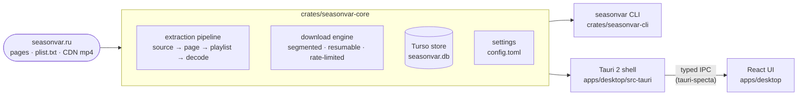

<div align="center">

# Seasonvar Downloader

**Modern, cross-platform desktop downloader (and CLI) for seasonvar.ru** — a from-scratch rewrite of
[DoITCreative/SeasonvarDownloader](https://github.com/DoITCreative/SeasonvarDownloader) (Qt/C++, 2019),
to whose authors the idea and the original protocol work belong.

[](https://github.com/ABCrimson/ModernSeasonvarDownloader/actions/workflows/ci.yml)
[](https://github.com/ABCrimson/ModernSeasonvarDownloader/actions/workflows/live.yml)
[](rust-toolchain.toml)
[](Cargo.toml)
[](apps/desktop/package.json)
[](package.json)
[](LICENSE)

[Design spec](docs/superpowers/specs/2026-08-22-seasonvar-downloader-rebuild-design.md) · [Bill of materials](docs/bom.html) · [ADRs](adr/README.md) · [Glossary](CONTEXT.md) · [Fixtures](fixtures/README.md) · [Original project](https://github.com/DoITCreative/SeasonvarDownloader)

</div>

> [!NOTE]
> Clean-room rewrite: no code (or language) is shared with the upstream project. The protocol was
> independently re-verified against the live site — the audit and its adversarial verification live in
> `docs/research/`, and the recorded responses it produced are the test fixtures.

## Status

| Milestone | Scope | State |
|---|---|---|
| **M0** | Workspace scaffold, every [BOM](docs/bom.html) pin, 3-OS CI gate | ✅ done |
| **M1** | Core extraction: `Source` → page → playlist → decode, search, naming, export; recorded fixtures | ✅ done |
| **M2** | CLI `info` / `links` / `search` / `export` / `config` with `--json` and exit codes | ✅ done |
| **M3** | Download engine + Turso store + settings; CLI `download` / `library` | 🚧 implemented — final review in flight |
| **M4** | Tauri shell: state, commands, events, typed bindings | ⏳ next |
| **M5** | UI: Home, Serial, Downloads, Library, Settings | ⏳ planned |

> [!WARNING]
> Pre-1.0, and deliberately bleeding-edge by policy ([ADR-0002](adr/0002-aggressive-pre-release-policy.md)):
> Rust `nightly-2026-08-27`, TypeScript 7 (native compiler), Vitest 5 RC, React 19.3 canary,
> Turso `0.8.0-pre.7`. Every bet has a named stable fallback recorded in the [BOM](docs/bom.html).

## Architecture

One pure-Rust library owns everything; the CLI and the desktop app are thin shells over it
([ADR-0001](adr/0001-rust-core-library-with-thin-front-ends.md)). The React UI never performs HTTP or
filesystem I/O; state lives in a single SQLite-format file owned by the core
([ADR-0005](adr/0005-turso-embedded-store.md)).



In tests, `wiremock` serves the recorded fixtures as a fake seasonvar.ru, so CI is deterministic and
offline; a nightly `live.yml` job runs one opt-in smoke test against the real site.

## CLI

The `seasonvar` binary (built from `crates/seasonvar-cli`) is what CI exercises end-to-end:

| Command | Does |
|---|---|
| `info <source>` | Show a serial: title, id, translations, seasons |
| `links <source>` | Print the media URLs of one translation, one per line |
| `search <query>` | Search the site (autocomplete) |
| `export <source>` | Render links as `wget` / `aria2c` / custom / M3U / JSON with Plex-style file names |
| `download <source>` | Download episodes of one translation (segmented, resumable; records to the library) |
| `library` | List what has been downloaded |
| `config` | Show or edit `config.toml` (`show` / `path` / `get` / `set` / `reset`) |

`<source>` is a serial URL, a site path (`/serial-<id>-<slug>.html`), or a bare numeric id (bare ids
reach the default translation only — translation names exist only on the page). Every command takes
`--json` (one JSON document on stdout, errors as `{"error":{kind,message,hint}}`), `--proxy
none|system|URL` (SOCKS5 included), `--base-url` and `--data-dir`.

```sh
seasonvar info "https://seasonvar.ru/serial-46176-<slug>-4-season.html"
seasonvar links "<serial url>" -t LostFilm -e 1-5,8
seasonvar export "<serial url>" -f aria2c -o season.txt
seasonvar download "<serial url>" -t 2 -e 1-8 -j 3 --limit 5120
seasonvar library --serial 46176
seasonvar config set engine.concurrent_jobs 4
```

<details>
<summary>Exit codes and environment variables</summary>

| Exit code | Meaning |
|---|---|
| `0` | success |
| `2` | usage or config error (bad flag, bad source, invalid `config.toml`) |
| `3` | serial not found / empty playlist |
| `4` | network, HTTP, timeout, decode or protocol error |
| `5` | I/O or database error (including `db_locked` — the desktop app owns the library file) |
| `130` | interrupted (Ctrl-C) |

| Variable | Effect |
|---|---|
| `SEASONVAR_DATA_DIR` | Put `config.toml`, `seasonvar.db` and logs under this directory (same as `--data-dir`) |
| `RUST_LOG` | Log filter (logs go to stderr; `-v/-vv/-vvv` otherwise) |
| `NO_COLOR` | Disable ANSI color |
| `SEASONVAR_LIVE=1` | Enable the `#[ignore]`d live smoke test (`cargo test -p seasonvar-core --test pipeline live_smoke -- --ignored`) |

Settings live in `config.toml`, the queue/library in `seasonvar.db`, both under the per-OS
config/data dirs (`seasonvar config path` prints the location). By default the database is
single-process: read commands never open it, and a second writer gets a `db_locked` error with a
hint; `--experimental-shared-db` opts into Turso's experimental multiprocess WAL.

</details>

## Develop

Toolchain (all pinned in-repo, nothing global to configure): Rust `nightly-2026-08-27` — rustup
auto-installs it from `rust-toolchain.toml`; Node 26 (`.nvmrc`); pnpm 12 (`corepack` is not used;
`pnpm` self-switches to the version pinned in `packageManager`). Linux additionally needs the Tauri
system packages (`libwebkit2gtk-4.1-dev libappindicator3-dev librsvg2-dev patchelf build-essential
libssl-dev`); Windows needs the MSVC toolchain and the WebView2 runtime.

| Command | Does |
|---|---|
| `pnpm install` | JS workspace deps + git hooks (lefthook) |
| `cargo nextest run --workspace --all-features` | Rust tests — 112 as of 2026-08-27 (plain `cargo test` works too) |
| `pnpm test` | Vitest (Browser Mode, real Chromium) |
| `pnpm e2e` | Playwright flows — first run: `pnpm --filter seasonvar-desktop exec playwright install chromium` |
| `pnpm dev` | Vite dev server (UI only, no Tauri) |
| `pnpm tauri dev` / `pnpm tauri build` | Desktop app / installers |
| `pnpm lint` / `pnpm lint:fix` | Biome (format + style) + oxlint (type-aware) |
| `pnpm typecheck` | TypeScript 7 native compiler |
| `pnpm knip` | Dead exports / unused deps |

CI runs the whole gate on Windows, macOS and Linux: `cargo fmt --check`, clippy with `-D warnings`,
rustdoc, nextest, `cargo deny check`, lint, typecheck, knip, Vitest, Playwright, and a full
`tauri build` — see [`.github/workflows/ci.yml`](.github/workflows/ci.yml).

## Repository layout

| Path | Contents |
|---|---|
| `crates/seasonvar-core` | The library: extraction pipeline, download engine, Turso store, settings, export |
| `crates/seasonvar-cli` | The `seasonvar` binary |
| `apps/desktop` | React UI (Vite) · `apps/desktop/src-tauri` — the Tauri 2 shell |
| `fixtures/` | Recorded site responses served by `wiremock` in tests ([README](fixtures/README.md)) |
| `docs/` | [BOM](docs/bom.html) · protocol/stack research · superpowers specs, plans, ledgers |
| `adr/` | [Architecture decision records](adr/README.md) |
| `CONTEXT.md` | [Project glossary](CONTEXT.md) — the vocabulary used in code, docs and UI |

## License

MIT — see [`LICENSE`](LICENSE). No code from the upstream project is used.
