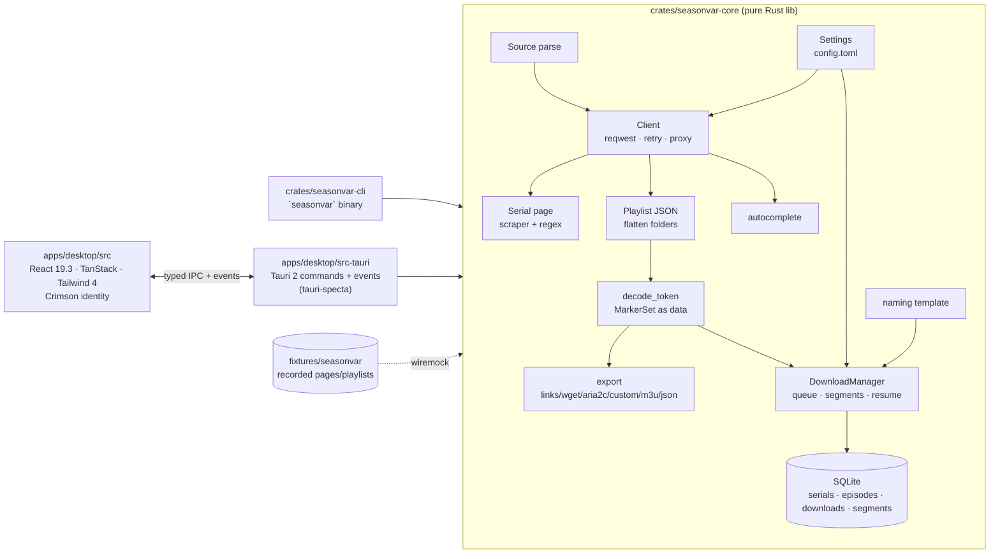

# Seasonvar Downloader — rebuild design

**Status:** approved in brainstorming 2026-08-22 (all four sections) · **Supersedes:** DoITCreative/SeasonvarDownloader (Qt/C++, 2019) · **Owner:** ABCrimson · **BOM:** `docs/bom.html` (v2, aggressive-RC policy) · **ADRs:** `adr/0001`–`0004` · **Glossary:** `CONTEXT.md`

## 1. Intent

Rebuild the 2019 Qt/C++ "SeasonVarPirateQt" from scratch as a modern, tested, cross-platform desktop downloader for seasonvar.ru, with the two features the original never finished (a real download manager and a download library), the site capabilities the original ignored (translations, seasons, metadata, subtitles, search), and a CLI that shares the same engine. Bleeding-edge stack by explicit choice, every version pinned and verified before the first line of code.

## 2. Context (why now)

- The upstream is ~1,300 lines of C++ whose extraction logic still works byte-for-byte against seasonvar.ru in Aug 2026 (verified live: `secureMark` → `playls2/<mark>/trans…/<id>/plist.txt` → `#2`+base64 tokens → direct mp4 on `*.11cdn.org`). Its UI, build system and error handling are dated; it has no tests, no CI, no license, and two stubbed features.
- No open-source tool does this well: yt-dlp has no seasonvar extractor; the ~46 seasonvar repos on GitHub are dead or partial; every one hardcodes the decoder's junk markers.
- The CDN serves mp4 with `Accept-Ranges: bytes`, no referer/cookie/token requirement and no rate limiting, which makes a parallel, resumable engine both possible and polite.

## 3. Goals and non-goals

**Goals (v1 = 0.1.0):**
1. Paste a seasonvar URL (or bare serial id) → see show metadata, every translation, sibling seasons, and a selectable episode list.
2. Download selected episodes with a queue: parallel segmented downloads, resume after pause/crash, retries, progress/ETA, OS notification on completion.
3. Library of what was downloaded (the original's "links database" stub), with open/reveal/re-download/remove.
4. Parity exports: copy links; generate `wget` / `aria2c` / custom-command scripts; plus M3U and JSON.
5. Proxy support (none / system / HTTP / SOCKS5) for geo-blocked users (the original's reason for existing).
6. Search by title from inside the app (site autocomplete).
7. CLI with the same capabilities, scriptable (`--json`), used by CI.
8. CI on Windows/macOS/Linux; tagged releases with installers.

**Non-goals (v1):** auto-updater, deep-link/URL-scheme handler, system tray/background mode, "track this show" notifications, subtitle *download* (subtitle URLs are parsed and exposed; downloading them is a v1.1 item), login/premium (`svid1`), legacy endpoints (`player.php`, `list.xml`, datalock), HLS/DRM (the site uses none), code signing, telemetry (never).

## 4. Research inputs (summary; full reports in `docs/research/`)

| Fact | Grade | Where |
|---|---|---|
| Serial page has `data4play = {'secureMark': '<32hex>', 'time', 'addr'}`; `var pl = {'0': "/playls2/<mark>/trans/<id>/plist.txt?time=…"}` plus inline `pl[N] = "/playls2/<mark>/trans<Name>/<id>/plist.txt?…"`; `<ul class="pgs-trans"><li data-click="translate" data-translate="N" data-translate-percent="p">Name</li>` (absent when single translation) | A | protocol-audit §2, protocol-verify #9 |
| Playlist is JSON: flat `{title,file,subtitle,galabel,id,vars}`; long shows nest `{title:"1-100 серия", folder:[…]}` chunks of 100 (One Piece: 1,176 episodes, one response) | A | protocol-verify #4 |
| Token decode (from `playerjs77.js`): strip `#2`, remove `"//"+base64("ololo")` (= `//b2xvbG8=`, inserted once at a random offset), legacy `"//"+base64("grid")`, then base64 → `//host/fi2lm/<mark>/7f_<Name>.sNNeNN.<q>.mp4` | A | protocol-verify #1–2, #7 |
| `secureMark`/`time` are **not validated** by the playlist endpoint or CDN; unknown id or unknown translation → `200 []`, never 403 | A | protocol-verify #3, #3b |
| CDN: 200 `video/mp4`, `Accept-Ranges: bytes`, Range → 206, no referer/cookie/expiry; ACAO `*` on `dataNN-cdn` hosts; plain http works | A | protocol-verify #8 |
| Titles are HTML: `N серия SD/FullHD<br>Translator`; quality only in title; one file per episode; no `" or "` alternates anymore | A | protocol-verify #2, #6 |
| `subtitle` = `[ru]<vtt-url>[,[eng]<vtt-url>]` on "Субтитры" playlists; VTT served as octet-stream starting `WEBVTT` | A | protocol-verify #5 |
| Slug must match the site's URL exactly; bare id → 404 page (but playlist with bare id works, default translation only — the upstream "film id" mode) | A | protocol-verify #11–12 |
| Search: `GET /autocomplete.php?query=<q>` → `{query, suggestions:{valu,kp}, data:[paths], id:[ids]}`; `GET /search?q=` HTML | A | protocol-verify #13 |
| Seasons: `.pgs-seaslist ul.tabs-result h2 a` (current prefixed ` >>> `, `<h2>`/`<a>` on separate lines); poster `og:image //cdn.bigsv.ru/oblojka/<id>.jpg`; `h1.pgs-sinfo-title` = "Сериал <RU>/<EN> N сезон" | A | protocol-verify #14 |
| No rate limiting, no cookies, no UA requirement observed (10 rapid requests, ~45/10 min) | A | protocol-verify #15 |
| yt-dlp/youtube-dl: no extractor, ever; no DMCA notices mentioning seasonvar/bigsv/11cdn in github/dmca | A | ecosystem §1, §5 |

## 5. Architecture



**Principle:** everything that talks to the network, the disk, or the database lives in `seasonvar-core` and is testable with `wiremock` + `tempfile`. The CLI and the Tauri app are thin adapters: argument parsing and progress bars; IPC commands and events. The React UI never touches HTTP or the filesystem (no `plugin-http`/`plugin-fs`).

### 5.1 Repository layout

```
ModernSeasonvarDownloader/
├── Cargo.toml                 # [workspace] members = crates/*, apps/desktop/src-tauri; [workspace.package] version/edition/license
├── rust-toolchain.toml        # channel = "beta-2026-08-18" (1.99.0-beta.1); components rustfmt, clippy
├── deny.toml · .nvmrc (26) · package.json (root, pnpm workspace) · pnpm-workspace.yaml · biome.json · .oxlintrc.json · lefthook.yml · knip.json · .editorconfig · .gitignore
├── crates/
│   ├── seasonvar-core/        # lib (see §6–§8)
│   └── seasonvar-cli/         # bin `seasonvar` (see §9)
├── apps/desktop/
│   ├── package.json · vite.config.ts · tsconfig.json · index.html · src/ (see §11)
│   └── src-tauri/             # Cargo crate `seasonvar-desktop` (see §10): src/, capabilities/, icons/, tauri.conf.json
├── fixtures/seasonvar/        # recorded responses (serials/, playlists/, misc/, playerjs/) + README with refresh script
├── docs/                      # superpowers/specs/, bom.html, research/
├── adr/ · CONTEXT.md · README.md · LICENSE (MIT) · CONTRIBUTING.md
└── .github/workflows/         # ci.yml, release.yml
```

### 5.2 Toolchain & versions

Authoritative list: `docs/bom.html` (v2). Headline pins: Rust 1.99.0-beta.1 (dated beta channel) · Node 26.7 · pnpm 12.0.0-rc.8 · TypeScript 7.0.2 · Tauri 2.11.5 / CLI 2.11.4 · React 19.3.0-canary-eafeac09-20260819 · Vite 8.2.2 (rolldown) + @vitejs/plugin-react 6.1.0 (React Compiler 1.0) · Tailwind 4.3.3 · shadcn 4.19 + radix-ui 1.7.0-rc · TanStack Query 5.101 / Router 1.170 / Virtual 3.14 · zustand 5 · zod 4.4 · Vitest 5.0.0-rc.2 Browser Mode (+ vitest-browser-react 2.2 with peer override) · Playwright 1.62 · Biome 2.5.10 + oxlint 1.79 (tsgolint 7.0.2001) · reqwest 0.13.4 (rustls default) · tokio 1.53 · scraper 0.27 · rusqlite 0.40 bundled · tauri-specta 2.0.0-rc.25. Every pre-release pin is exact; every bet has a named fallback (BOM "Risks").

**Scaffold gate (M0):** commit 1 must pass `pnpm install --frozen-lockfile`, `cargo build --locked`, `cargo nextest run`, `pnpm test`, and `pnpm tauri build` on all three CI OSes before any feature code. A bet that fails the gate drops to its fallback immediately and the BOM is re-issued.

## 6. Core: domain model and extraction pipeline

### 6.1 Types (Rust, `seasonvar_core`)

```rust
pub enum Source { Url(SerialUrl), Id(u32) }           // Source::parse("https://seasonvar.ru/serial-46176-Zvezdnyj_put…-4-season.html" | "seasonvar.ru/serial-…" | "/serial-…" | "46176")
pub struct SerialUrl { pub id: u32, pub slug: String } // canonical(): https://seasonvar.ru/serial-{id}-{slug}.html  (slug includes any -N-season suffix verbatim)

pub struct Serial {
  pub id: u32, pub slug: Option<String>, pub url: Option<Url>,
  pub title: Title,                     // { ru: String, en: Option<String> }  from h1.pgs-sinfo-title "Сериал <RU>/<EN> N сезон"; og:title fallback
  pub season_number: Option<u32>,
  pub poster_url: Option<Url>,          // og:image, scheme-normalized
  pub description: Option<String>,      // meta description / .pgs-sinfo_list text, plain
  pub secure_mark: Option<String>,
  pub translations: Vec<Translation>,   // ≥1; [Translation{id:0,name:"Стандартный",..}] when no pgs-trans block
  pub seasons: Vec<SeasonLink>,         // sibling seasons incl. self (current: true)
  pub fetched_at: jiff::Timestamp,
}
pub struct Translation { pub id: u32, pub name: String, pub playlist_path: String, pub share_percent: Option<f32> }
impl Translation { pub fn kind(&self) -> TranslationKind /* Dub | Subtitles ("Субтитры") | Trailers ("Трейлеры") */ }
pub struct SeasonLink { pub id: u32, pub url: Url, pub label: String, pub current: bool, pub note: Option<String> /* "(17.08.2026 1-8 серия из 32)" */ }

pub struct Playlist { pub serial_id: u32, pub translation: Translation, pub episodes: Vec<Episode>, pub fetched_at: jiff::Timestamp }
pub struct Episode {
  pub ordinal: u32,                     // 1-based position after flattening
  pub number: Option<u32>,              // parsed from "N серия"; None if absent
  pub title: String,                    // HTML-stripped, entities decoded: "1 серия SD/FullHD RuDub"
  pub quality: Option<String>,          // "SD/FullHD"
  pub translator: Option<String>,       // "RuDub" (text after <br>)
  pub token: String,                    // raw "file" value, kept for diagnostics
  pub media_url: Url,                   // decoded, https
  pub subtitles: Vec<Subtitle>,         // [{lang:"ru", url}, {lang:"eng", url}]
  pub galabel: Option<String>, pub vars: Option<String>, pub site_id: Option<String>,
}
pub struct Subtitle { pub lang: String, pub url: Url }
pub struct SearchHit { pub id: u32, pub title: String, pub path: String, pub url: Url }
```

### 6.2 Client

`Client::new(ClientConfig { base_url: Url (default https://seasonvar.ru), proxy: Proxy::{None,System,Http(Url),Socks5(Url)}, timeout: 15s, user_agent: browser-like, markers: MarkerSet })`. Wraps `reqwest::Client` (rustls default, gzip/brotli/zstd, HTTP/2). All fetches use `backon` exponential backoff (3 attempts, 250 ms base, jitter) on network errors and 5xx; never on 4xx. `base_url` injection is how tests point the client at `wiremock`.

### 6.3 Pipeline

1. **`Client::fetch_serial(&Source) -> Result<Serial>`**
   - `Source::Url` → GET canonical URL. 404 → `CoreError::SerialNotFound { id, hint: "the slug must match the site's URL exactly" }`. Parse with `scraper` (DOM) + `regex`:
     - `secureMark` from `'secureMark': '([0-9a-f]{32})'`.
     - translations: `ul.pgs-trans li[data-click="translate"]` → `data-translate` (id), text (name), `data-translate-percent` (share); playlist path from `var pl = {'0': "…"}` and `pl[N] = "…"` scripts (percent-decode nothing; keep the site's encoding). If `ul.pgs-trans` is absent → one translation `{0, "Стандартный", pl['0']}`.
     - seasons: `.pgs-seaslist ul.tabs-result h2 a` → href/id/label; leading ` >>> ` marks current; trailing `<span>` is `note`.
     - title: `h1.pgs-sinfo-title` → strip leading "Сериал ", split RU/EN on `/` (first `/` that separates Cyrillic from Latin; if no EN, `en = None`), strip trailing "N сезон" → `season_number`.
     - poster: `meta[property="og:image"]` → `//…` → `https://…`.
   - `Source::Id(id)` → no page fetch; `Serial { id, translations: [default], secure_mark: None, … }` ("film id" mode). Playlist URL is built as `/playls2/{mark_or_zeros}/trans/{id}/plist.txt` (mark is not validated — verified).
2. **`Client::fetch_playlist(&Serial, &Translation) -> Result<Playlist>`** — GET `base_url + translation.playlist_path` (add `?time=<now>` if missing). Body → `Vec<Item>` where `enum Item { Flat(RawEpisode), Folder { title, folder: Vec<Item> } }` (serde untagged); flatten depth-first; `[]` → `CoreError::EmptyPlaylist { translation }`. Each `RawEpisode.file` → `decode_token`; `title` → `number/quality/translator` via `^(\d+)\s*серия\s*(?P<q>[^<]*)?(?:<br\s*/?>(?P<t>.*))?$` (lenient; fallback: `number = None`, `title = stripped html`); `subtitle` → `\[(\w+)\]([^,]+)` pairs.
3. **`decode::decode_token(token: &str, markers: &MarkerSet) -> Result<Url, DecodeError>`**
   - Require prefix `#2` → else `DecodeError::UnsupportedScheme(prefix)`.
   - `body = token[2..]`; for each marker (default `MarkerSet::default() = ["//b2xvbG8=", "//Z3JpZA=="]`, i.e. `"//" + b64("ololo")`, `"//" + b64("grid")`) remove **all** occurrences (observed count is 1; removing all is safe and robust).
   - base64 decode (standard alphabet, tolerate missing padding). On failure → generic fallback: remove every run matching `//[A-Za-z0-9+/]+={0,2}` and retry once. Still failing → `DecodeError::Base64 { token }`.
   - Result must match `^//[^/]+/.+` → `Url::parse("https:" + decoded)`; else `DecodeError::NotAUrl { decoded }`.
   - `MarkerSet` is data: `Settings.site.markers` overrides the default; the UI exposes it under *Settings → Advanced*.
4. **`Client::autocomplete(&str) -> Result<Vec<SearchHit>>`** — GET `/autocomplete.php?query=<urlencoded>`; zip `data[i]` (path) with `id[i]` and `suggestions.valu[i]` (title).
5. **`export::render(&[Episode], Format, &NameContextProvider) -> String`** — `Format::{Links, Wget, Aria2c, Custom(String cmd), M3u, Json}`; `Wget` → `wget -c -O "<name>" "<url>"` lines with a `#!/usr/bin/env sh` header; `Aria2c` → one aria2c input-file style (`url\n  out=<name>`) plus a one-liner header comment; `Custom` → `<cmd> "<url>"` per line; `M3u` → `#EXTM3U` with `#EXTINF:-1,<title>`; `Json` → serialized `Episode`s (without `token`).
6. **`naming::Template`** — default `"{show}/Season {season:02}/{show} S{season:02}E{episode:02} [{translation}].mp4"`. Tokens: `{show}` (title per `title_language`: `en` if present else `ru`), `{show_ru}`, `{show_en}`, `{season}`, `{episode}` (number, else ordinal), `{title}`, `{translation}`, `{quality}`, `{id}`, `{ext}`; `:02` width modifier on numerics. Rendering sanitizes each path segment (`sanitize-filename` + strip `:`/`?`/`*`/`"`/`<>`/`|`, collapse whitespace, trim dots/spaces on Windows, cap segment at 200 bytes, reserved names like `CON` suffixed `_`). Preview function used by the Settings screen.

### 6.4 Errors

```rust
#[derive(thiserror::Error, Debug)]
pub enum CoreError {
  InvalidSource(String), SerialNotFound { id: u32 }, EmptyPlaylist { translation: String },
  Decode(#[from] DecodeError), Http { status: u16, url: Url }, Network(#[from] reqwest::Error),
  Io(#[from] std::io::Error), Db(#[from] rusqlite::Error), Config(String), Cancelled,
}
impl CoreError { pub fn hint(&self) -> Option<&'static str> }  // e.g. Http{403} → "This region may be blocked by the provider — set a proxy in Settings." ; SerialNotFound → "Paste the full URL from the site; the slug must match."
```
Errors cross the Tauri boundary as `{ kind, message, hint }` (serde), never as strings.

### 6.5 Fixtures and tests (core)

- `fixtures/seasonvar/serials/*.html` (13), `playlists/*.json` (30 incl. nested-folder `plist-3312-0.json`, subtitles `plist-22063-1.json`, `8f_` `plist-2219-1.json`), `misc/autocomplete-*.json`, `search-*.html`, `sub-*.vtt`, `cdn-heads*.txt`, `playerjs/*` (decoded decoder for reference). `fixtures/README.md` documents provenance (date, client IP-keyed `secureMark`) and a `capture.sh` to refresh.
- Unit: `Source::parse` table test; `decode_token` (all fixtures decode to `^https://[^/]+/fi2lm/.+\.mp4$`; proptest: random insertion of each marker at any offset round-trips; malformed inputs map to the right `DecodeError`); title parsing; `naming` (Windows/Unix sanitization, width modifiers, Cyrillic, 200-byte cap).
- Snapshot (`insta`): each serial fixture → `Serial` (redacted `fetched_at`); each playlist → `Playlist` summary (count, first/last episode, subtitle count).
- Integration (`wiremock`): serve fixtures by path; run `fetch_serial` → `fetch_playlist` for every translation → assert counts; 404/`[]`/5xx paths map to the right errors; retry policy retries 503 then succeeds.
- Live (opt-in `SEASONVAR_LIVE=1`): one serial end-to-end + one CDN `HEAD`; nightly CI job, allowed to fail without blocking.

## 7. Core: download engine

### 7.1 Model

```rust
pub struct Limits { pub concurrent_jobs: u8 /*3*/, pub segments_per_job: u8 /*4*/, pub max_connections: u16 /*= jobs×segments = 12*/, pub speed_limit_bps: Option<u64>, pub retries: u8 /*5*/, pub min_segment_bytes: u64 /*4 MiB*/ }
pub struct Job { pub id: Uuid /*v7*/, pub episode: EpisodeRef { serial_id, translation_id, ordinal }, pub media_url: Url, pub target_path: PathBuf, pub state: JobState, pub bytes_total: Option<u64>, pub bytes_done: u64, pub etag: Option<String>, pub priority: i64, pub error: Option<JobError>, pub created_at, pub updated_at, pub completed_at: Option<Timestamp> }
pub enum JobState { Queued, Starting, Downloading, Paused, Completed, Failed { retryable: bool }, Cancelled, Exists /* final file already present, skipped */ }
pub enum Event { Queued(JobSnapshot), Started(JobSnapshot), Progress { id, done, total, bps, eta_secs }, Paused(id), Resumed(id), Completed { id, path }, Failed { id, error, retryable }, Cancelled(id), QueueChanged(Vec<JobSnapshot>) }
pub struct Manager { /* Arc<Inner>: tokio handles, Semaphore(max_connections), broadcast::Sender<Event>, Db, Client, Settings */ }
impl Manager {
  pub fn start(db, client, settings) -> Manager;            // loads incomplete jobs; auto-resumes if settings.general.auto_resume
  pub async fn enqueue(&self, items: Vec<EnqueueItem>) -> Vec<JobSnapshot>;   // EnqueueItem { episode, media_url, name_ctx } → target_path via template; dedupe by (episode, target_path)
  pub async fn pause(&self, id) / resume(&self, id) / cancel(&self, id) / retry(&self, id) / move_to_top(&self, id) / pause_all / resume_all;
  pub fn subscribe(&self) -> broadcast::Receiver<Event>;   // capacity 1024; slow consumers get Lagged and re-snapshot
  pub async fn snapshot(&self) -> Vec<JobSnapshot>;
  pub async fn shutdown(&self);                            // cancels tasks, persists segment progress, flushes DB
}
```

### 7.2 Algorithm (per job)

1. `GET` with `Range: bytes=0-0` → `206` gives `Content-Range` total, `ETag`, `Last-Modified`; `200` means no range support → single-segment stream. Record `bytes_total`, `etag`.
2. If final file exists with size == total → `Exists` (unless `overwrite`). Else open/create `<target>.part` and `set_len(total)`.
3. Segments: `n = clamp(total / min_segment_bytes, 1, segments_per_job)`; ranges `[start, end]` stored in `download_segments` with `done = 0` (or loaded from DB on resume; if `etag` differs from stored → reset all to 0).
4. Each segment task: acquire the global `Semaphore` permit; `GET Range: bytes={start+done}-{end}`; stream chunks → `file.seek(start+done)` + write; increment segment `done` and job `AtomicU64`; on error → `backon` retry (up to `retries`, exponential with jitter); permanent failure → job `Failed { retryable: true }` (other segments are cancelled). Speed limit: a shared token bucket that chunks `await` before writing.
5. Progress publisher: per job, at most every 250 ms (or on state change) emit `Progress` with EWMA `bps` (1 s window) and `eta`. Persist `done` per segment to DB every 2 s and on pause/shutdown.
6. Completion: all segments done → `fsync` → verify `part.len() == total` → rename `.part` → final (create parent dirs) → `Completed { path }` → DB `completed_at`. Mismatch → `Failed { retryable: true }` with sizes in the error.
7. Pause: cancel the job's `CancellationToken` children; state `Paused`; `.part` and DB rows kept. Resume: re-run from step 3 using stored segments. Cancel: cancel + delete `.part` + DB state `Cancelled`. Retry: reset error, state `Queued`.
8. Scheduler: a single loop picks `Queued` jobs by `(priority desc, created_at asc)` while `active < concurrent_jobs`. `move_to_top` bumps priority above the current max.
9. Shutdown (app exit / Ctrl-C): cancel all, persist, close DB; on next start, `Downloading/Starting` rows become `Paused` and auto-resume if enabled.

### 7.3 Persistence

SQLite file `seasonvar.db` in the core data dir (WAL, `synchronous=NORMAL`, busy_timeout 5 s), opened once, accessed through `spawn_blocking`. Migrations via `rusqlite_migration` (`user_version`).

```sql
CREATE TABLE serials (id INTEGER PRIMARY KEY, slug TEXT, url TEXT, title_ru TEXT NOT NULL, title_en TEXT, season_number INTEGER, poster_url TEXT, description TEXT, first_seen_at TEXT NOT NULL, last_seen_at TEXT NOT NULL);
CREATE TABLE translations (serial_id INTEGER NOT NULL REFERENCES serials(id), id INTEGER NOT NULL, name TEXT NOT NULL, playlist_path TEXT NOT NULL, share_percent REAL, PRIMARY KEY (serial_id, id));
CREATE TABLE episodes (serial_id INTEGER NOT NULL, translation_id INTEGER NOT NULL, ordinal INTEGER NOT NULL, number INTEGER, title TEXT NOT NULL, quality TEXT, translator TEXT, media_url TEXT NOT NULL, subtitles_json TEXT NOT NULL DEFAULT '[]', last_seen_at TEXT NOT NULL, PRIMARY KEY (serial_id, translation_id, ordinal));
CREATE TABLE downloads (id TEXT PRIMARY KEY, serial_id INTEGER NOT NULL, translation_id INTEGER NOT NULL, ordinal INTEGER NOT NULL, media_url TEXT NOT NULL, target_path TEXT NOT NULL, state TEXT NOT NULL, bytes_total INTEGER, bytes_done INTEGER NOT NULL DEFAULT 0, etag TEXT, error_json TEXT, priority INTEGER NOT NULL DEFAULT 0, created_at TEXT NOT NULL, updated_at TEXT NOT NULL, completed_at TEXT);
CREATE INDEX downloads_state ON downloads(state, priority DESC, created_at);
CREATE TABLE download_segments (download_id TEXT NOT NULL REFERENCES downloads(id) ON DELETE CASCADE, idx INTEGER NOT NULL, start INTEGER NOT NULL, end INTEGER NOT NULL, done INTEGER NOT NULL DEFAULT 0, PRIMARY KEY (download_id, idx));
```
Library queries: downloads joined to episodes/serials, grouped by serial → `LibraryShow { serial, items: [LibraryItem { download, episode, exists_on_disk }] }`; `remove_record(id)` never deletes files (the UI offers "reveal" and the OS does deletion); `redownload(id)` enqueues again.

### 7.4 Settings (`config.toml`, owned by core, shared by CLI and GUI)

Location: `directories::ProjectDirs::from("io.github", "ABCrimson", "SeasonvarDownloader")` → config dir `config.toml`, data dir `seasonvar.db` + `logs/`. (Windows: `%APPDATA%\ABCrimson\SeasonvarDownloader\config\config.toml`.)

```toml
[general]
download_dir = "<OS Videos dir>/Seasonvar"     # created on first download
title_language = "en"                           # "en" | "ru"  (en falls back to ru when absent)
naming_template = "{show}/Season {season:02}/{show} S{season:02}E{episode:02} [{translation}].mp4"
auto_resume = true
overwrite = false
[engine]
concurrent_jobs = 3
segments_per_job = 4
speed_limit_kbps = 0                            # 0 = unlimited
retries = 5
[network]
proxy = "system"                                # "none" | "system" | "http://host:port" | "socks5://host:port"
timeout_secs = 15
user_agent = "Mozilla/5.0 … Chrome/128 …"
[site]
base_url = "https://seasonvar.ru"
markers = ["//b2xvbG8=", "//Z3JpZA=="]          # Playerjs junk markers; edit if the site rotates keys
```
Validated with a typed `Settings` struct (+ `validate()`); unknown keys preserved; missing file → defaults written on first save. The Tauri app reads/writes the same file through core (`get_settings`/`set_settings`); UI-only prefs (theme, window, last route) live in `tauri-plugin-store`.

## 8. Core: observability

`tracing` spans: `fetch_serial{id}`, `fetch_playlist{id,translation}`, `download{job}`, `segment{job,idx}`. Binaries install subscribers: CLI → `tracing-subscriber` env-filter to stderr; desktop → `tauri-plugin-log` rotating file in the data dir + devtools console in debug. No network telemetry of any kind.

## 9. CLI (`seasonvar`)

```
seasonvar info     <source> [--json]
seasonvar links    <source> [-t|--translation <id|name>] [-e|--episodes 1-5,8,10-] [--json]
seasonvar search   <query> [--json]
seasonvar download <source> [-t …] [-e …] [-d|--dir PATH] [--template TPL] [-j|--jobs N] [--segments N] [--limit KBPS] [--overwrite] [-y|--yes]
seasonvar export   <source> --format links|wget|aria2c|custom|m3u|json [--cmd "<program>"] [-t …] [-e …] [-o FILE]
seasonvar library  [list [--json] | open <id> | remove <id> | redownload <id>]
seasonvar config   [path | show | set <key> <value> | edit]
global: --proxy <none|system|url> --base-url <url> -q/-v  (RUST_LOG honored)  · exit codes: 0 ok · 2 usage · 3 not found/empty · 4 network · 5 io/db · 130 interrupted
```
Behavior: `<source>` accepts URL/path/id. With >1 translation and no `-t` → `dialoguer` select (TTY) or translation 0 (non-TTY/`--json`/`--yes`). `download` shows `indicatif` multi-bars (per job + total) and honors Ctrl-C (graceful shutdown, resumable). `links --json` is the CI smoke test against wiremock.

## 10. Desktop: Tauri layer (`apps/desktop/src-tauri`, crate `seasonvar-desktop`)

- **State:** `AppState { client: Client, db: Db, manager: Manager, settings: RwLock<Settings> }` built in `setup`; `Manager::start` on launch; `shutdown` on `RunEvent::ExitRequested`.
- **Commands** (tauri-specta, all `async`, errors as `CoreErrorDto { kind, message, hint }`):
  `parse_source(input) -> SourceDto` · `fetch_serial(input) -> Serial` · `fetch_playlist(serial_id, translation_id) -> Playlist` · `search(query) -> Vec<SearchHit>` · `enqueue(items: Vec<EnqueueRequest>) -> Vec<JobSnapshot>` · `pause(id)` `resume(id)` `cancel(id)` `retry(id)` `move_to_top(id)` `pause_all()` `resume_all()` · `list_jobs() -> Vec<JobSnapshot>` · `library_list() -> Vec<LibraryShow>` `library_remove(id)` `library_redownload(id)` · `export(serial_id, translation_id, ordinals, format, cmd?) -> String` · `render_name_preview(template, sample) -> String` · `get_settings() -> Settings` `set_settings(Settings)` · `test_proxy(proxy) -> ProxyTestResult` · `recent_serials(limit) -> Vec<SerialSummary>`.
- **Events** (typed via tauri-specta): `download:progress` (batched every 250 ms: `Vec<Progress>`), `download:state` (`JobSnapshot`), `queue:changed` (`Vec<JobSnapshot>`), `settings:changed`.
- **Plugins:** dialog (folder pick), opener (reveal/open), store (UI prefs), notification, clipboard-manager, window-state, single-instance, log. **Capabilities** (`capabilities/default.json`): only those permissions; no fs/http/shell.
- **Bundle:** identifier `io.github.abcrimson.seasonvar-downloader`, product name "Seasonvar Downloader", version read from the workspace `Cargo.toml`; targets NSIS + MSI (Windows, WebView2 bootstrapper), DMG universal (macOS), AppImage + deb (Linux). Window: 1200×780 min 900×600, `decorations` native, `window-state` restores.

## 11. Desktop: frontend (`apps/desktop/src`)

- **Stack:** React 19.3 canary (React Compiler on), TypeScript 7, Vite 8, Tailwind 4 (CSS-first, tokens from the Crimson identity in OKLCH), shadcn 4 components copied into `src/components/ui`, TanStack Router (file routes in `src/routes`), TanStack Query (all `invoke` calls via generated `commands.*`), zustand (selection + transient UI), zod (settings form), sonner, cmdk, lucide, self-hosted Geist (or Inter; design pass decides).
- **Routes:** `/` Home · `/serial/$id?translation=N` Serial · `/downloads` · `/library` · `/settings`. App shell: left rail (Home, Downloads with active-count badge, Library, Settings), top command bar (⌘K). `<Activity>` keeps `/downloads` mounted while on other routes so live progress never re-subscribes; `<ViewTransition>` on route changes and translation-tab switches.
- **Home:** paste box (auto-detect URL/id; `⌘V` anywhere focuses it; clipboard hint if the clipboard holds a seasonvar URL), ⌘K search palette (autocomplete, debounced 150 ms), Recent shows (from `recent_serials`), empty-state explainer.
- **Serial:** header (poster, RU/EN title, season number, season switcher as a segmented control from `seasons`), translation tabs (name + share %, kind icon for subtitles/trailers), virtualized episode list (checkbox, number, title, quality badge, CC badge if subtitles, per-row "copy link"), selection tools (all / none / invert / range `1-5,8`), sticky action bar: **Download selected** (shows target folder + count, opens folder picker if unset), **Copy links**, **Export…** (dialog: format, custom command, copy/save). Already-downloaded episodes show a check with "in library".
- **Downloads:** queue table (title, show, translation, progress bar with segment strip, size, speed, ETA, state chip, actions pause/resume/cancel/retry/move-to-top/reveal), global bar (pause all / resume all / clear finished / open folder), `useOptimistic` for instant state flips, progress from the batched event → zustand store → rows (no re-render storm).
- **Library:** grouped by show (poster, title, count, size), items with state/exists-on-disk, actions open/reveal/re-download/remove record; search filter.
- **Settings:** download folder (picker), title language, naming template with live preview (`render_name_preview`), engine limits (jobs/segments/speed), network (proxy select + URL + **Test**), advanced (markers list, base URL), about (version, links, logs folder). Saved through `set_settings` with zod validation client-side and `Settings::validate` server-side.
- **Design:** Crimson identity (`crimson-design` skill is the source of truth): dark glass OKLCH palette, gold primary / violet secondary, red/green only for failed/completed semantics, layered shadows, micro-interactions with `linear()` easings, `@starting-style` entries, `prefers-reduced-motion` respected, `:focus-visible` gold rings, tabular numerals on every number. Dark-only for v1 (the operator's preference); tokens are structured so a light theme can be added.
- **Keyboard map** (⌘ on macOS = Ctrl on Windows/Linux): `⌘K` search · `⌘V` paste URL · `⌘D` download selected · `Space` toggle row · `Shift+click` range · `⌘A` select all · `Esc` clear · `⌘,` settings · `⌘1..4` routes.
- **Errors:** every failed command shows a sonner toast with `message` + `hint`; route-level `react-error-boundary` with retry.

## 12. Testing strategy (whole repo)

| Layer | Tool | What |
|---|---|---|
| core unit | `cargo nextest`, proptest, insta | Source parse, decoder, title parse, naming, settings validate, export rendering |
| core integration | wiremock + tempfile | page→playlist→decode over fixtures; engine: segmented download of a 10 MB body with Range, pause/resume, crash-resume (drop manager, re-create from DB), ETag change, no-range server, speed limit, cancel deletes `.part` |
| CLI | assert_cmd-style via `std::process::Command` in tests | `links --json` against wiremock; exit codes; `--help` snapshot |
| frontend unit/component | Vitest 5 RC Browser Mode (Chromium) + vitest-browser-react | episode list selection logic, naming preview, queue row states, settings form validation |
| frontend flows | Playwright 1.62 + `@tauri-apps/api/mocks` (`mockIPC`, `mockWindows`) | paste → serial → select → enqueue → progress events → library; error toast with hint; ⌘K search |
| static | Biome (format+style), oxlint `--type-aware`, `tsc --noEmit`, knip, `cargo fmt --check`, `cargo clippy -D warnings`, `cargo deny check` | every push |
| live | `SEASONVAR_LIVE=1` | nightly, non-blocking |

## 13. CI / release

- `ci.yml` (push, PR): jobs `rust` (3-OS matrix: fmt, clippy, nextest, deny), `web` (ubuntu: biome, oxlint, tsc, knip, vitest browser with Playwright chromium, playwright flows), `build` (3-OS: `pnpm tauri build` → upload-artifact). Caches: rust-cache, pnpm store. Linux apt deps per BOM.
- `release.yml` (tag `v*`): tauri-action on the 3-OS matrix → GitHub Release with NSIS+MSI, DMG (universal), AppImage+deb; release notes from the tag body. Unsigned.
- Version single-sourced from `[workspace.package] version`; `scripts/release.mjs` bumps Cargo/package.json, commits, tags.

## 14. Milestones (the plan derives tasks from these)

| # | Outcome | Gate |
|---|---|---|
| M0 | Workspace scaffold with every BOM pin; CI green on 3 OSes running one Rust test, one browser-mode test, one Playwright flow, and a `tauri build` | the scaffold gate (§5.2) |
| M1 | `seasonvar-core` extraction: Source, Client, fetch_serial, fetch_playlist, decode, autocomplete, naming, export; fixtures committed; unit/snapshot/wiremock tests green | all 13 serial + 30 playlist fixtures parse; decoder proptest |
| M2 | CLI `info/links/search/export/config` + `--json`; CI smoke | `seasonvar links --json` against wiremock in CI |
| M3 | Download engine + SQLite + settings; CLI `download`/`library` | engine integration tests incl. crash-resume |
| M4 | Tauri shell: state, commands, events, typed bindings, capabilities, settings bridge; minimal UI proves IPC | `pnpm tauri dev` round-trip |
| M5 | UI: Home, Serial, Downloads, Library, Settings with Crimson identity; component + flow tests | all flows green in CI |
| M6 | Polish: notifications, keyboard map, view transitions, error hints, empty states, logs | manual QA checklist |
| M7 | Docs (README with screenshots, CONTRIBUTING, fixtures/README), release workflow, `v0.1.0` tag → installers on GitHub Release | release assets present on all 3 OSes |

## 15. Risks and fallbacks

See `docs/bom.html` "Risks & kill criteria" for per-bet fallbacks. Project-level: site key rotation (markers as data + fixture refresh); endpoint moves behind auth/DRM (kill criterion for the direct-mp4 approach); aggregate RC risk (M0 gate); repo recreation is irreversible (done once, at M0, after the user refreshes the `gh` token scope).

## 16. Repository operations

- Local: `git init` on `main` in the project folder; the spec, ADRs, BOM, research and fixtures are the first commit.
- Remote (M0, user's explicit choice): delete the existing fork `ABCrimson/ModernSeasonvarDownloader` (requires `gh auth refresh -h github.com -s delete_repo`, interactive) and create a clean public repo with the same name; push `main`; enable Actions. README credits `DoITCreative/SeasonvarDownloader` as the original.
- License: MIT (new code). The upstream has no license file; nothing from it is copied (clean-room rewrite in a different language; only the protocol facts, independently re-verified, carry over).

## 17. Deliberately unresolved (with assumed defaults)

- Subtitle downloading → v1.1; default: URLs exposed in UI/JSON only.
- Light theme → later; default dark-only.
- Auto-updater, deep links, tray → deferred per scope choice.
- Windows ARM64 / Linux ARM64 builds → not in the matrix; default x64 (+ macOS universal).
- Font: Geist vs Inter → design pass; default Geist.
